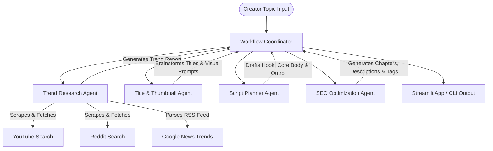

# Creators AI - YouTube Creator Intelligence System

Creators AI is a multi-agent AI system designed to empower content creators by automating trend research, brainstorming titles and thumbnails, drafting high-retention video scripts, and optimizing SEO metadata.

---

## 🌟 Key Features

1. **📊 Trend Research Agent**: Searches YouTube search volumes/views, Reddit communities, and Google News RSS feeds to extract target audience pain points and trending angles for a topic.
2. **🎨 Title & Thumbnail Agent**: Proposes 5 click-worthy title options and matches them with visual layout descriptions and text-to-image prompts. Integrates with a **free AI image generator** (Pollinations.ai) to preview thumb backgrounds in the UI.
3. **📝 Script Planner Agent**: Constructs structured outlines detailing Hooks (opening lines), pacing, transition markers, and specific B-roll/graphic visual cues.
4. **🔍 SEO Optimization Agent**: Suggests search-friendly video descriptions, YouTube chapters/timestamps, target tags, hashtags, and analyzes an overall SEO optimization score.

---

## 🏗️ Architecture



---

## ⚙️ Setup and Installation

### 1. Prerequisites
- Python 3.9+
- A Gemini API Key (get one for free at [Google AI Studio](https://aistudio.google.com/))

### 2. Install Dependencies
Clone/navigate to the directory and run:
```bash
pip install -r requirements.txt
```

### 3. Set API Key (Optional)
You can set your Gemini API key in an environment variable or a `.env` file:
```bash
GEMINI_API_KEY=your_gemini_api_key_here
```
*(Alternatively, you can paste the API Key directly in the web interface sidebar).*

---

## 🚀 Running the Application

### Option A: Launch Web Interface (Recommended)
Run the main script to start the Streamlit web dashboard:
```bash
python main.py
```
This launches a browser window (usually at `http://localhost:8501`) where you can step through each agent's execution, edit findings, and generate thumbnail mockup visuals.

### Option B: Run via CLI
Run the entire automated multi-agent workflow via your command line interface and save the results directly to a markdown file:
```bash
python main.py --topic "learning rust programming" --api-key "YOUR_GEMINI_API_KEY"
```
This produces a `creators_ai_learning_rust_programming.md` file in the project directory containing reports from all agents.
